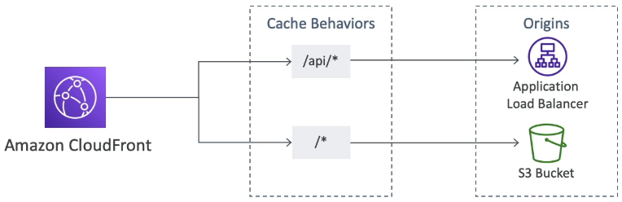

import Callout from '@/components/callout.astro'

## What is CloudFront?

Amazon CloudFront is AWS’s content delivery network (CDN) service.

It improves read performance by caching content at edge locations closer to users.

- Supports both **static** and **dynamic** content delivery
- Routes users to edge locations with the **lowest latency**
- Helps reduce load on the origin by serving cached content from the edge

---

## Security and protection

CloudFront includes several security-related features and integrations.

- Integrates with **AWS Shield** for DDoS protection
- Can be associated with **AWS WAF** to inspect and filter web requests
- Supports **HTTPS** for viewers
- Can also use **HTTPS** when communicating with supported origins

<Callout variant="important">
CloudFront can secure both the **viewer-to-CloudFront** connection and, when supported by the origin type, the **CloudFront-to-origin** connection.
</Callout>

---

## Field-level encryption

Field-level encryption adds another layer of protection on top of HTTPS.

- Encrypts specific sensitive fields in requests
- Encryption happens at the **edge**, closer to the user
- Uses **asymmetric encryption**
- Helps ensure that only authorised applications can decrypt sensitive fields

<Callout variant="important">
HTTPS protects data in transit, while **field-level encryption** can additionally protect specific sensitive fields throughout the processing path.
</Callout>

---

## Origins

CloudFront can serve content from different origin types.

### S3 bucket origin

Use an Amazon S3 bucket origin when you want CloudFront to cache and distribute files from S3.

- Good for distributing files globally with edge caching
- Recommended to secure S3 origins using **Origin Access Control (OAC)**
- **Origin Access Identity (OAI)** still exists, but it is considered **legacy**
- OAC supports additional scenarios such as **SSE-KMS** and dynamic requests like `PUT` and `DELETE`

<Callout variant="important">
For S3 origins, prefer **OAC** over **OAI**. OAI is legacy and no longer the recommended choice.
</Callout>

### Custom origin

Use a custom origin when the backend is not a standard S3 bucket origin.

Examples include:
- **Application Load Balancer**
- **EC2 instance**
- **S3 static website endpoint**
- Any other **HTTP/HTTPS backend**

### HTTPS to origin

For custom origins, CloudFront supports:
- **HTTP only**
- **HTTPS only**
- **Match Viewer**

<Callout variant="note">
An S3 **website endpoint** is treated as a **custom origin**, and S3 website endpoints do **not** support HTTPS from CloudFront to the origin.
</Callout>

---

## Multiple origins

A single CloudFront distribution can use multiple origins.

This is useful when you want to route requests to different backends based on the request pattern.

### Common use cases

- Send `/images/*` to an S3 origin
- Send `/api/*` to an ALB or EC2 backend
- Split static and dynamic content across different origins

---

## Origin groups

Origin groups are used for **high availability** and **failover**.

- An origin group contains **one primary** and **one secondary** origin
- CloudFront sends requests to the primary origin first
- If the primary origin fails or returns configured failure status codes, CloudFront fails over to the secondary origin

<Callout variant="important">
CloudFront origin failover applies only to viewer requests that use `GET`, `HEAD`, or `OPTIONS`.
</Callout>

---

## Geo restriction

CloudFront can restrict access to content based on the viewer’s country.

### Types
- **Allowlist**: only users from approved countries can access the content
- **Block list**: users from blocked countries cannot access the content

<Callout variant="note">
CloudFront geographic restriction works at the **country level**. If you need finer-grained geographic control, AWS recommends using a third-party geolocation solution.
</Callout>

---

## Price classes

CloudFront price classes let you reduce cost by limiting which edge locations are used.

### Types
- **Price Class All**: all edge locations, best performance
- **Price Class 200**: excludes some of the most expensive locations
- **Price Class 100**: uses only the least expensive group of locations

<Callout variant="tip">
A common exam trade-off is this: lower price classes reduce cost, but may increase latency for some users.
</Callout>

---

## Signed URLs and signed cookies

CloudFront signed URLs and signed cookies are used to restrict access to private content.

### Signed URL
Use when you want to control access to **individual files**.

- One signed URL is typically used for one file or one resource path
- Common for downloads or access to a single protected asset

### Signed cookie
Use when you want to control access to **multiple files**.

- Better when users need access to a group of protected files
- Useful for streaming, paid content, or authenticated sessions across multiple assets

### Access control details
CloudFront signed URLs and signed cookies can include:
- an **expiration time**
- an optional **start time**
- an optional **IP address range restriction**

AWS recommends using **trusted key groups** for signing.

<Callout variant="important">
Choose **signed URLs** for access to individual files, and **signed cookies** when the user needs access to multiple files.
</Callout>

---

## CloudFront vs S3 pre-signed URL

CloudFront signed URLs and S3 pre-signed URLs are not the same.

- **CloudFront signed URLs** are used to control access through the CDN
- **S3 pre-signed URLs** give direct temporary access to S3 objects

<Callout variant="note">
If the question is about protecting content delivered through a **CDN**, think **CloudFront signed URLs or cookies**, not S3 pre-signed URLs.
</Callout>
