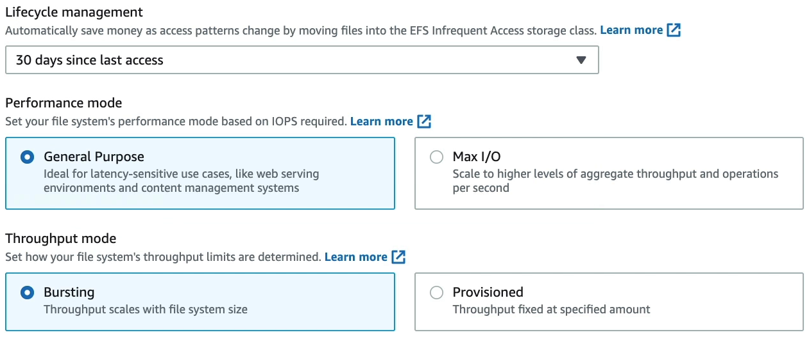

import Callout from '@/components/callout.astro'

## What is EFS?

Amazon Elastic File System (EFS) is AWS’s managed file storage service that provides shared, elastic file storage for multiple compute instances.

It is a managed **Network File System (NFS)** that can be mounted by multiple clients at the same time.

- EFS uses the **NFSv4** protocol.
- Multiple EC2 instances can access the same EFS file system concurrently.
- EFS is commonly used when multiple instances need shared access to the same files.
- EFS is designed to scale automatically as your file system grows.

<Callout variant="note">
Think of EFS as **shared file storage** for EC2, whereas EBS is typically attached to one instance at a time.
</Callout>
---
## Compatibility

EFS can be mounted from supported EC2 clients using NFS.

- Supported for **Linux-based EC2 instances**.
- Supported for **EC2 macOS instances**.
- ❌ **Not supported** for **Windows–based EC2 instances**.

<Callout variant="important">
If an exam question asks for a shared file system for Windows EC2 instances, **EFS is not the right answer**.
</Callout>
---
## File system types

EFS offers two file system types.

### Types

- **Regional**: stores data across multiple Availability Zones within the same Region and is the recommended option for higher availability.
- **One Zone**: stores data in a single Availability Zone and is lower cost, but less resilient than Regional.

<Callout variant="note">
Use **Regional** when you want multi-AZ resilience. Use **One Zone** only when lower cost matters more than multi-AZ durability.
</Callout>
---
## Storage classes and lifecycle management

EFS supports lifecycle management to move files between storage classes automatically based on access patterns.
### Storage classes

- **EFS Standard**: for frequently accessed files and the lowest latency.
- **EFS Infrequent Access (IA)**: for files accessed only occasionally.
- **EFS Archive**: for very infrequently accessed files.

### Key points

- Lifecycle management can automatically move files from **Standard** to **IA** and then to **Archive**.
- By default, AWS’s recommended lifecycle policy transitions files to **IA after 30 days** and to **Archive after 90 days** without access.
- Files can also be configured to move back to **Standard** on first access.

<Callout variant="tip">
A good way to remember this: **Standard** for active data, **IA** for cold data, **Archive** for very cold data.
</Callout>
---
## Performance modes

EFS provides two performance modes.

### Types

- **General Purpose**  (Default & Recommended): best for latency-sensitive workloads such as web servers, CMS workloads, and general file serving.
- **Max I/O**: designed for highly parallel workloads that can tolerate higher latency.

### Key points

- AWS recommends **General Purpose** for most workloads.
- **Max I/O** is considered a previous-generation option.
- The **performance mode is set at creation time** and cannot be changed later.
- **Max I/O** is not supported for **One Zone** file systems or file systems using **Elastic throughput**.

<Callout variant="important">
For most exam scenarios, choose **General Purpose** unless the question clearly describes a highly parallel workload that can tolerate higher latency.
</Callout>
---
## Throughput modes

Throughput mode determines how much throughput the file system can deliver.

### Types

- **Elastic** (Default & Recommended): throughput scales automatically up or down with workload demand.
- **Provisioned**: you specify the throughput you want, independent of storage size. Useful when you need predictable throughput regardless of file system size.
- **Bursting**: throughput scales with the amount of data stored in **EFS Standard**.
