import Callout from '@/components/callout.astro'

## What is Google Compute Engine?

Google Compute Engine (GCE) is Google Cloud’s Infrastructure-as-a-Service (IaaS) offering for creating and managing the lifecycle of **virtual machine (VM) instances**.

It provides:

- Scalable and flexible compute resources
- Persistent storage options
- Advanced networking capabilities
- Integration with other GCP services

This makes it suitable for workloads such as:

- Web and application hosting
- Data processing
- High-performance computing (HPC)
---
## Pre-requisites
Before creating a VM instance, you need to:

1. Create a **Google Cloud project**
2. Set up **billing**
3. Enable the **Compute Engine API**
---
## Machine families and machine types

Compute Engine offers different **machine families** depending on the kind of workload you are running.
### General purpose

Good price-to-performance balance for common workloads such as:

- Web and application servers
- Small-to-medium databases
- Development and test environments

Examples:

- `E2`
- `N2`
- `N2D`
- `N1`

### Memory-optimised

Designed for workloads that need very large amounts of memory, such as:

- In-memory databases
- In-memory analytics

Examples:

- `M1`
- `M2`

### Compute-optimised

Designed for compute-intensive workloads.

Example use case:

- Gaming applications

Example:

- `C2`
---
## Reading a machine type

A machine type like `e2-standard-2` can be broken down as follows:

- `e2` → machine type family
- `standard` → type of workload
- `2` → number of vCPUs

<Callout variant="important">
In exam-style questions, pay attention to both the **machine family** and the **workload profile**. The service is not just asking for “a VM”, but for the VM that best matches the workload characteristics.
</Callout>
---
## VM networking and IP behaviour

When you **stop** a VM instance, its **external IP address is usually lost** unless you explicitly reserve and use a **static external IP**.

Before (with the instance running):
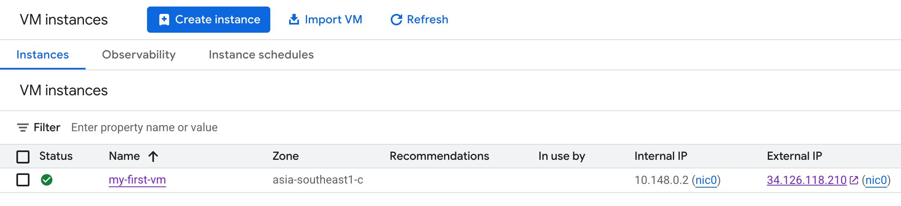

After (with the instance stopped):
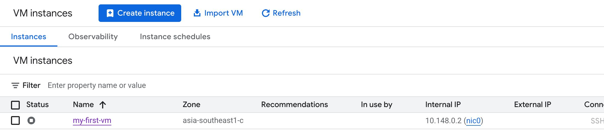

### Static external IPs

A static external IP:

- Can be retained across instance stops and restarts
- Can be detached and reattached when needed
- Incurs charges when it is **not in use**

An instance still retains its static external IP even when stopped:
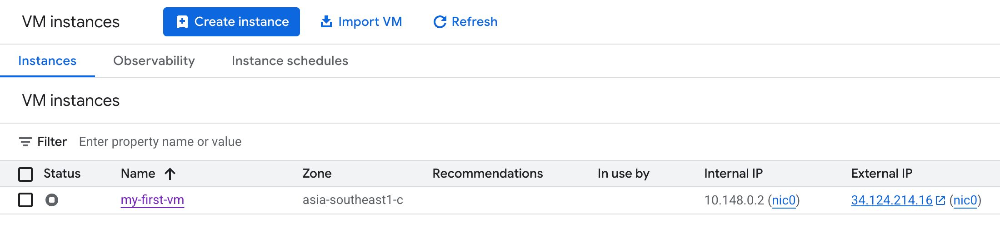

A common misconception is that a static IP cannot be switched to another VM in the same project. That is **not true**.

<Callout variant="important">
A stopped VM **DOES NOT** continue billing for compute, but you are **still billed for any resources that remain attached**, such as storage. Static IPs can also incur charges when left unused.
</Callout>
---
## Reducing VM setup effort

If you find yourself repeatedly creating similar VMs, there are a few ways to reduce manual setup.

### Startup scripts

Startup scripts are useful for **bootstrapping** a VM when it launches, for example:

- Installing packages
- Applying OS patches
- Setting up an HTTP server
- Running initial configuration steps

This is flexible, but it **increases boot time** because setup happens during instance startup.

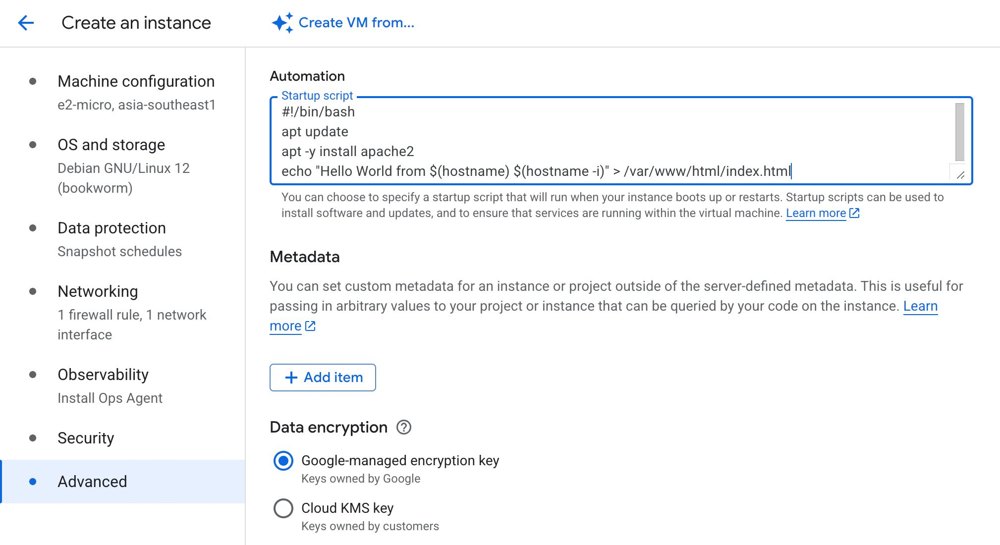
### Instance templates

Instance templates let you define a reusable configuration for creating VM instances and Managed Instance Groups (MIGs).

They help standardise things like:

- Machine type
- Boot image
- Firewall settings
- Metadata
- Startup scripts

Instance templates are especially useful when you want to avoid specifying the same VM details over and over again.

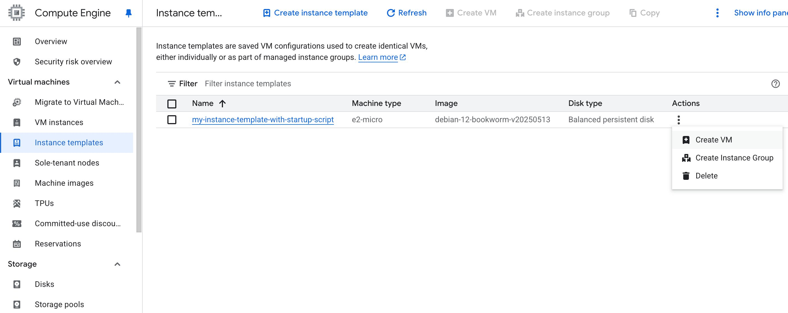

<Callout variant="important">
Instance templates are **immutable**. If you want to change one, you create a copy and modify the new version instead of updating the original.
</Callout>

### Custom images

Custom images help reduce launch time by baking required software and configuration into the image ahead of time.

They are useful when you want to:

- Avoid repeated installation steps during boot
- Launch instances **faster**
- Standardise hardened images for **security and compliance**

A custom image can be created from:

- A VM instance
- A persistent disk
- A snapshot
- Another image
- A file in Cloud Storage

Creating a custom image from a disk: 
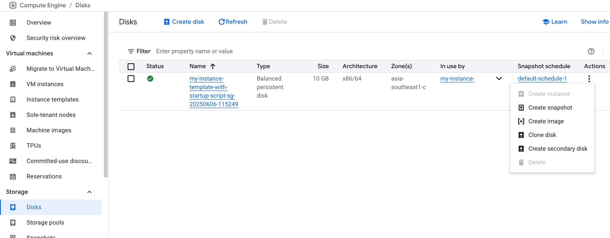

Creating an instance template from a custom image:
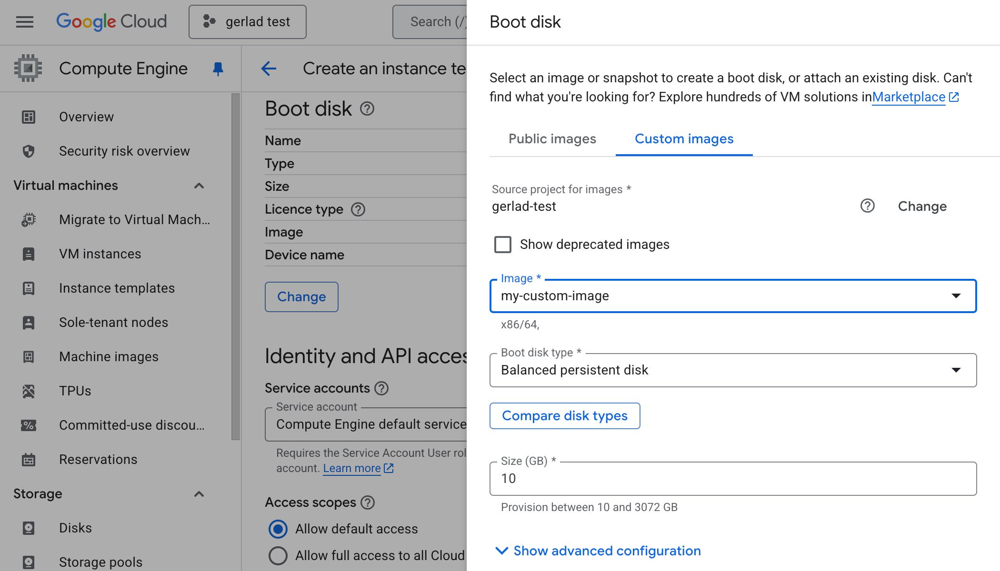

### Which should you use?

One way to think about it:

- **Startup script** → good for lightweight bootstrapping
- **Instance template** → good for repeatable VM definitions
- **Custom image** → best when you want faster launch time and pre-installed dependencies

<Callout variant="tip">
If the main goal is to reduce startup time, a **custom hardened image** is usually the better choice than repeatedly installing software through startup scripts.
</Callout>
---
## Pricing and discounts

### Sustained use discounts

Sustained use discounts are **automatically applied** when eligible VM instances run for a significant portion of the billing month.

These **ONLY** apply to instances created by:

- Google Compute Engine (GCE)
- Google Kubernetes Engine (GKE)

They do **not** apply to certain machine types, such as:

- `E2`
- `A2`

### Committed use discounts (CUDs)

Committed use discounts are meant for workloads with **predictable resource usage**.

You commit to usage for:

- **1 year**
- **3 years** (usually gives a higher discount rate than 1 year)

These commitments can involve:

- Hardware commitments
- Software licensing commitments

### Custom machine type billing

Custom machine types are billed based on the amount of:

- **vCPUs**
- **Memory**

that you provision for the instance.

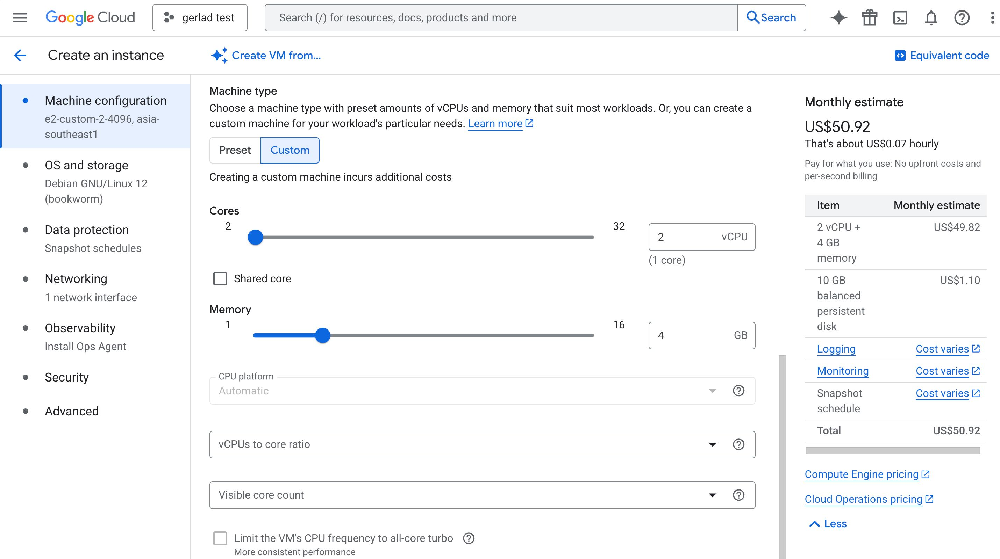

---
## Spot VMs

Basically AWS's Spot Instances.

Spot VMs are short-lived, lower-cost compute instances that can be terminated by Google Cloud when capacity is needed elsewhere.

Key characteristics:

- Typically much cheaper than regular VMs (~60–91%)
- Can be stopped by GCP at any time
- Preemption comes with a **30-second warning**
- Best suited for interruptible workloads

Good use cases include:

- **Fault-tolerant** applications
- **Cost-sensitive** workloads
- Batch processing
- Work that is **not immediately time-critical**

<Callout variant="note">
Spot VMs are the latest version of **preemptible VMs**, but does not have a maximum runtime, unlike the 24 hours of **preemptible VMs**.
</Callout>

<Callout variant="important">
Use Spot VMs only when your application can tolerate interruption. They are not a good fit for workloads that require guaranteed availability.
</Callout>
---
## Availability, maintenance, and live migration

When Google needs to perform host maintenance (e.g. a software/hardware update needs to be performed), Compute Engine can keep supported workloads running through **live migration**.

### Live migration

Live migration moves a running VM to another host in the same zone without changing the VM’s properties.

It helps minimise disruption during:

- Planned infrastructure maintenance
- Certain host-level events

However, live migration is **not supported** for:

- GPUs
- Spot VMs

### Availability policy

Two important settings to know for **Live Migration** are:

#### On host maintenance

Define what happens during planned maintenance:

- **Migrate** → move the VM to another host
- **Terminate** → stop the VM

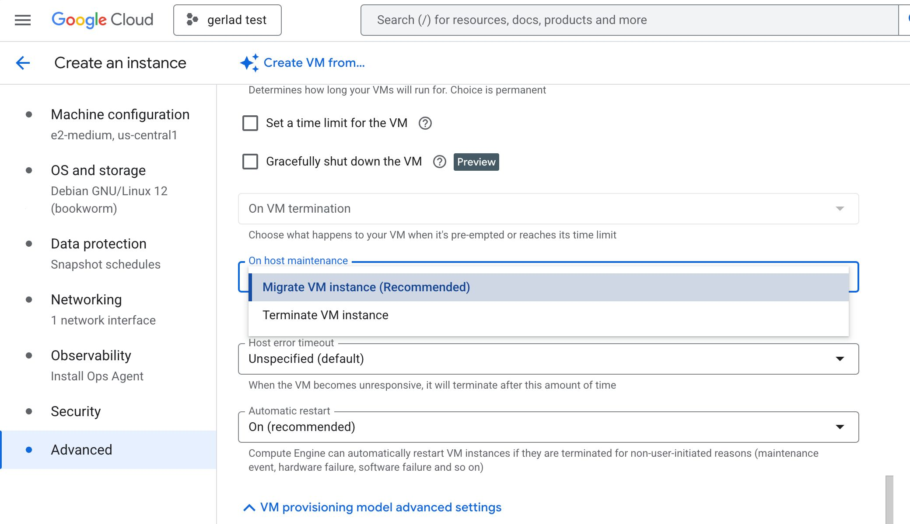
#### Automatic restart

Controls whether a VM is restarted when it is terminated for non-user-initiated reasons such as:

- Maintenance events
- Hardware failure

<Callout variant="tip">
If you want better availability during maintenance events, use an availability policy with:
- **On host maintenance: Migrate**
- **Automatic restart: On**
</Callout>
---
## GPUs and special infrastructure options

### GPUs

If you attach a GPU to a VM but it is **not being used properly** for AI/ML or graphics workloads, one likely reason is that the **image does not include the required GPU libraries**.

In practice, you should use images that already have the relevant GPU stack installed, such as deep learning images where appropriate. Otherwise, the GPU will NOT be utilised.

### Sole-tenant nodes

If a customer needs **dedicated hardware** for compliance, licensing, or isolation requirements, recommend **sole-tenant nodes**.

These allow VM instances to run on hardware dedicated to a single customer.

Creating sole-tenant nodes:
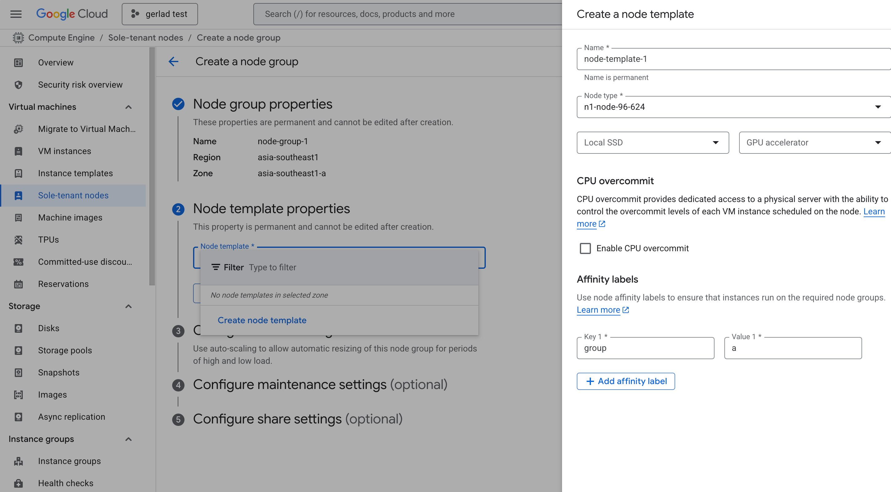

Creating VM instances in sole-tenant nodes:
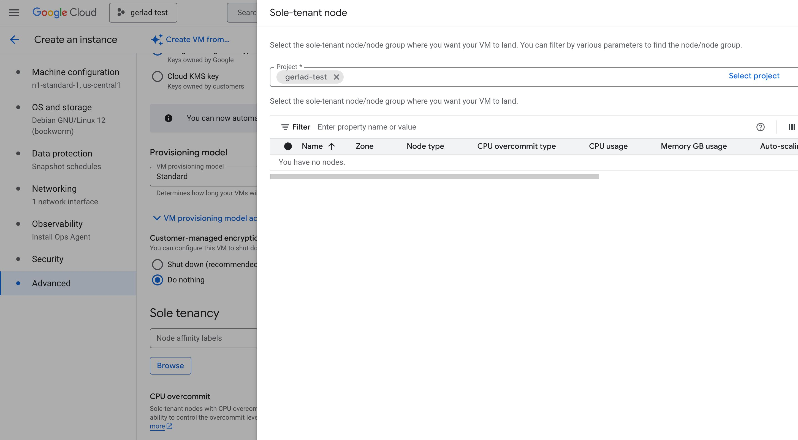

---
## Fleet operations and monitoring

### VM Manager

If a customer is operating a very large VM fleet and wants to automate things like:

- OS patch management
- OS inventory management
- OS configuration management (manage software installed)

then **VM Manager** is the relevant service to use.

### Default metrics

Without installing the Cloud Monitoring / Ops Agent, one metric available by default is:

- **CPU utilisation**

Metrics such as memory utilisation or disk space utilisation typically require additional agent-based monitoring.

---
## Instance groups

Compute Engine supports two broad kinds of instance groups.

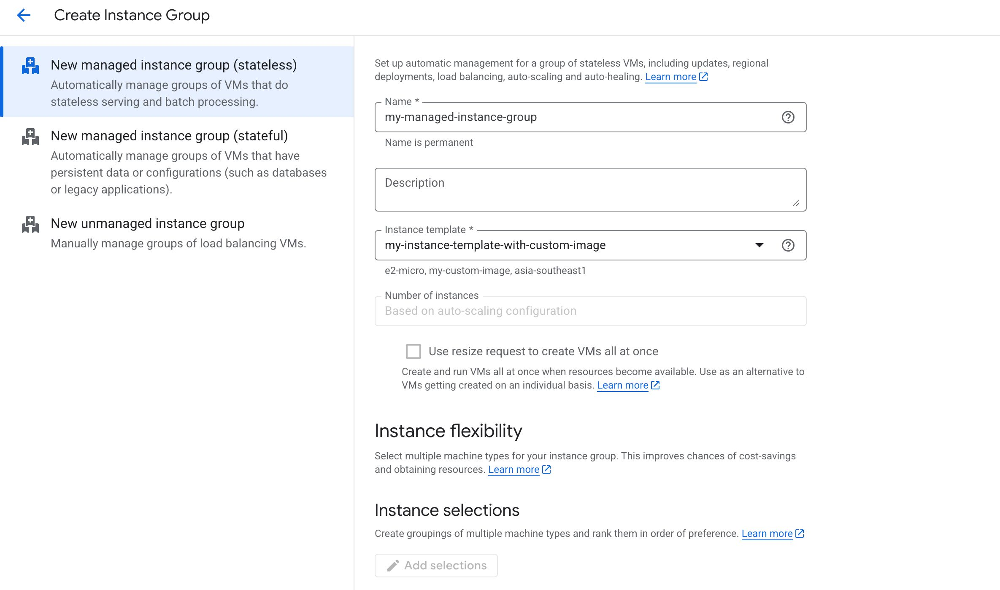

### Managed instance groups (MIGs)

Managed Instance Groups contain **identical VMs** created from an **instance template**.

They support features such as:

- Auto-scaling
- Auto-healing
- Managed rolling updates and releases

### Unmanaged instance groups

Unmanaged instance groups allow VMs with **different configurations** to exist in the same group.

They do **NOT** provide the management features that MIGs do, such as:

- ❌ Auto-scaling
- ❌ Auto-healing
- ❌ Managed rolling releases

Use them only when you specifically need a group of non-identical VMs.

<Callout variant="important">
A managed instance group cannot contain VMs with different machine types or different base configurations. If that flexibility is required, use an **unmanaged instance group** instead.
</Callout>
---
## Managed instance groups (MIGs)

MIGs are the more important type to know in practice and in exam questions because they are the standard way to run scalable, self-healing VM workloads.

### Core benefits

A MIG gives you:

- Standardised VM creation through an instance template
- Auto-scaling based on load or metrics
- Auto-healing using health checks
- Controlled rolling updates
- Easier high availability design

### Types of MIGs
#### Stateless MIGs

Use these for stateless workloads such as:

- Web applications
- REST APIs
- Batch processing

#### Stateful MIGs

A stateful MIG can preserve things like:

- Instance name
- Attached persistent disks
- Metadata

Use these when VM state needs to be preserved for workloads such as:

- Databases
- Data processing systems with persistent state

---
## Important MIG configurations

### Auto-scaling

Auto-scaling automatically adjusts the number of instances based on demand.

Important settings include:

- **Minimum number of instances**
- **Maximum number of instances**
- **Autoscaling signals**, such as:
  - CPU utilisation target
  - Load balancer utilisation target
  - Other monitoring metrics
- **Initialisation period**
- **Scale-in controls**

#### Initialisation period

This is how long your application takes to become ready after the VM starts.

It matters because the autoscaler should not make decisions based on instances that are still warming up.

<Callout variant="note">
If you want to reduce frequent scale-ups and scale-downs, pay attention to the **initialisation period**:
- `gcloud compute instance-groups managed update INSTANCE_GROUP_NAME --initial-delay=INITIAL_DELAY{:bash}`
</Callout>

#### Scale-in controls

These help avoid aggressive scale-in behaviour, for example by limiting how many instances can be removed over a short period.

### Auto-healing

Auto-healing **replaces unhealthy instances automatically**, enabling self-healing behaviour.

To enable it properly, configure:

- A **health check**
- An **initial delay**, so health checks do not fail instances before the application has finished starting up

---
## Rolling updates, restart, and replace

MIGs support controlled rollout strategies for updates and application releases without downtime.
### Managed releases

Two common release patterns are:

- **Rolling updates**: update instances gradually in batches (update % of instances at a time)
- **Canary deployments**: test a new version on a smaller subset of instances before releasing it across all instances

Canary testing with the second instance template:
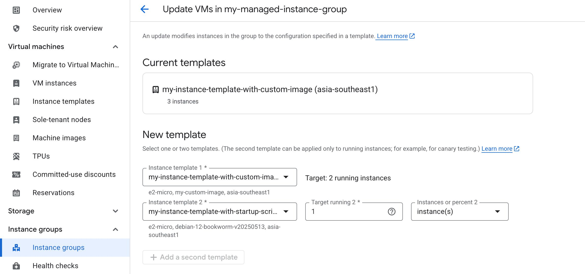
### Rolling restart vs rolling replace

- **Rolling restart** restarts VMs gradually across the group 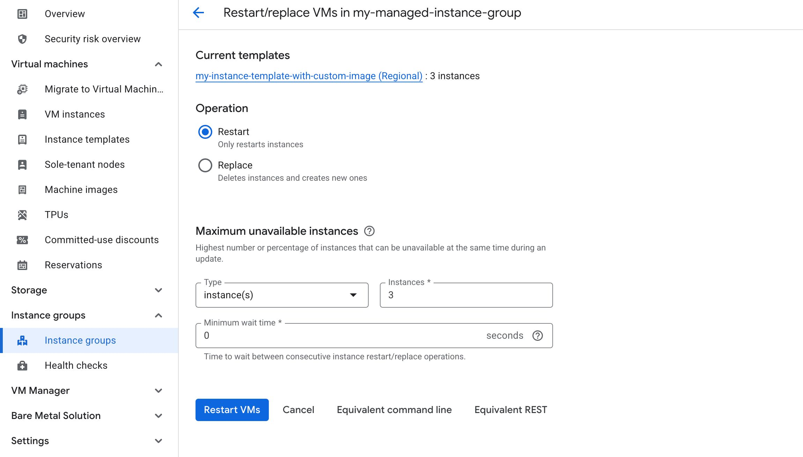
- **Rolling replace** replaces VMs gradually across the group 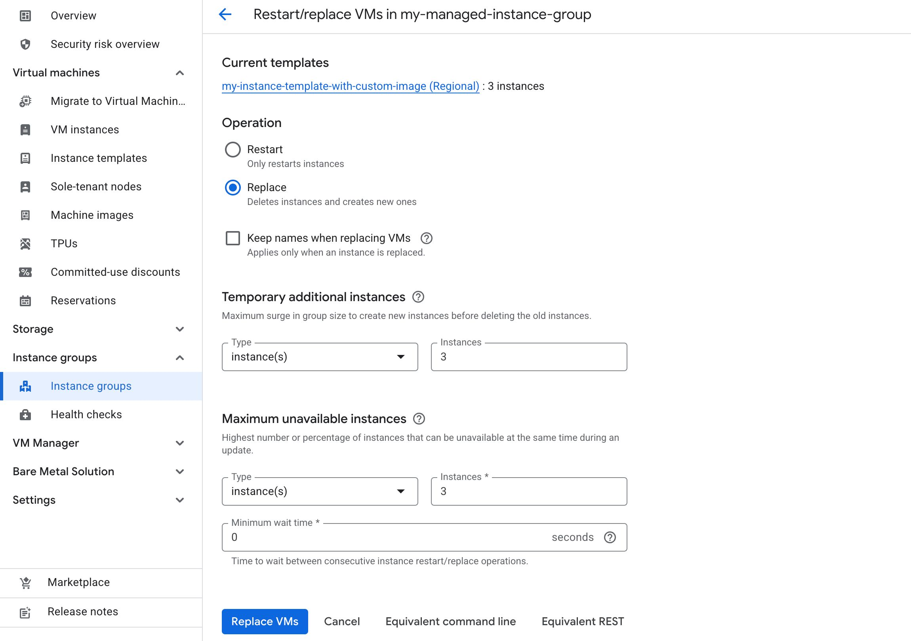

### Update modes

There are two ways to specify how a rolling update happens:

- **Proactive**: starts the update immediately.
- **Opportunistic**: applies updates later, such as when the instance group is resized.

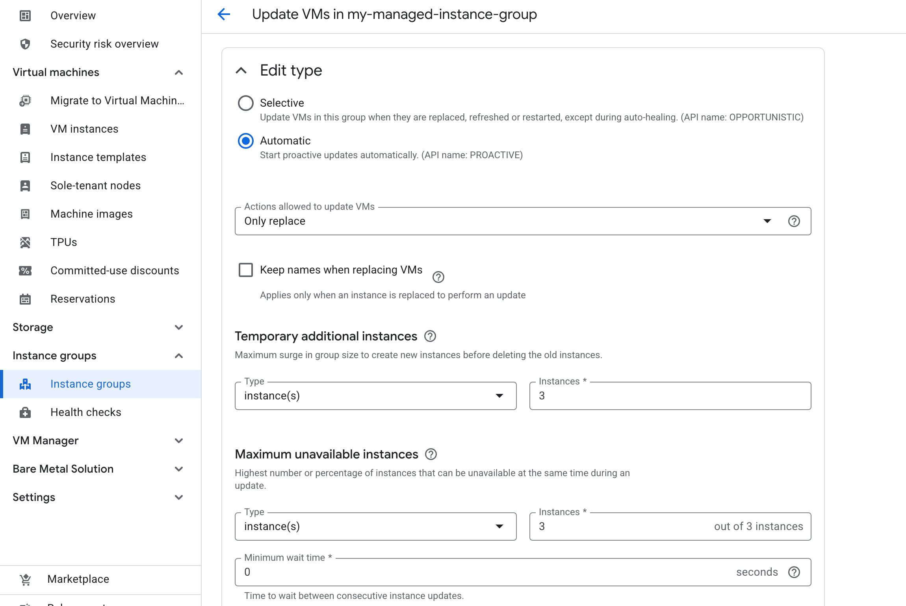
### Key rollout controls

Two important rollout settings are:

- **Maximum surge** (a.k.a. `Temporary additional instances`): how many extra instances can be added during the rollout
- **Maximum unavailable** (a.k.a. `Maximum unavailable instances`): how many instances can be offline during the rollout

<Callout variant="important">
If you want to make a new release **without reducing capacity**, set the flag **max-unavailable** to the value 0:
- `gcloud compute instance-groups managed rolling-action replace --max-unavailable=0{:bash}`
- `gcloud compute instance-groups managed rolling-action restart --max-unavailable=0{:bash}`
</Callout>
---
## High availability with MIGs

If you want a MIG-backed application to survive **zonal failures**, use a **regional Managed Instance Group**, which spreads instances across multiple zones.

This improves resilience compared to keeping all instances in a single zone.

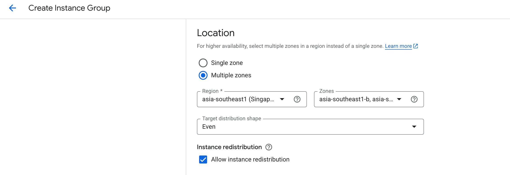

---
## Quick decision guide

### Use a startup script when...

- You need lightweight bootstrapping at launch
- Installation time is acceptable
- The setup may change frequently

### Use an instance template when...

- You want repeatable VM definitions
- You want to launch similar VMs consistently
- You are creating a Managed Instance Group

### Use a custom image when...

- You want faster boot times
- You need pre-installed software
- You want a standardised or hardened base image

### Use a managed instance group when...

- You need auto-scaling
- You need self-healing
- You want controlled rollouts
- You are running a scalable application tier

### Use an unmanaged instance group when...

- You need a loose grouping of VMs
- The VMs have different configurations
- You do not need managed scaling or healing

---
## Architecture flow to remember

A common high-level flow for serving a VM-based application is:

**Instance Template → Instance Group → HTTP Load Balancer**

---
## Key takeaways

- Compute Engine is GCP’s core VM service
- Machine family selection should match workload characteristics
- Instance templates improve repeatability, while custom images improve launch speed
- Static IPs help preserve external addressing across restarts
- Spot VMs are cheaper, but interruptible
- Live migration helps supported workloads stay available during maintenance
- MIGs are the preferred way to run scalable, self-healing VM fleets
- Regional MIGs improve resilience against zonal failure
