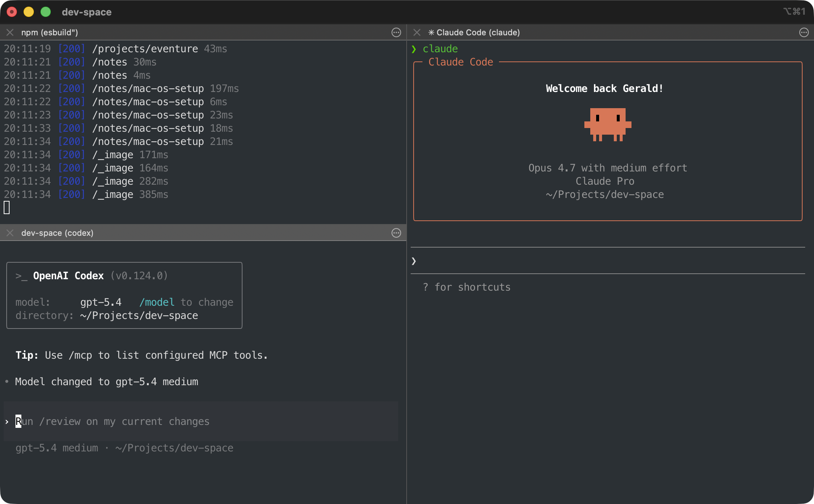
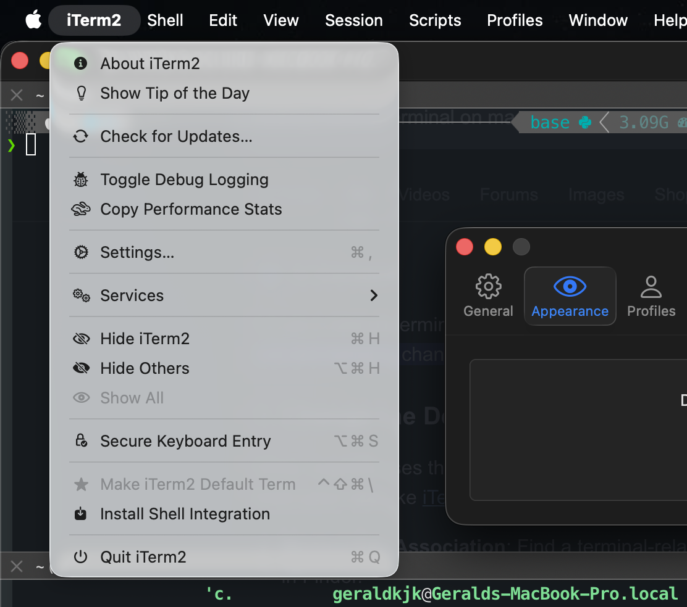
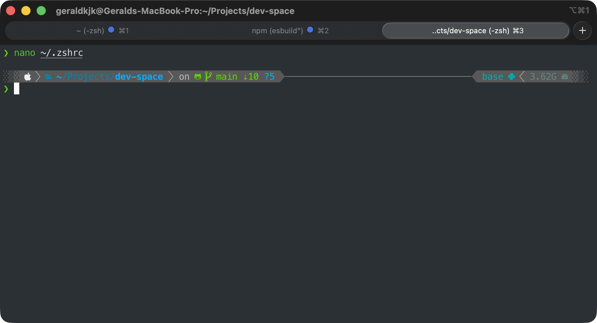
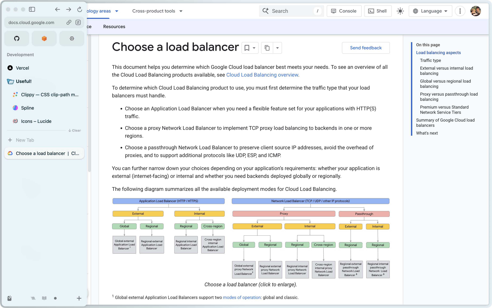
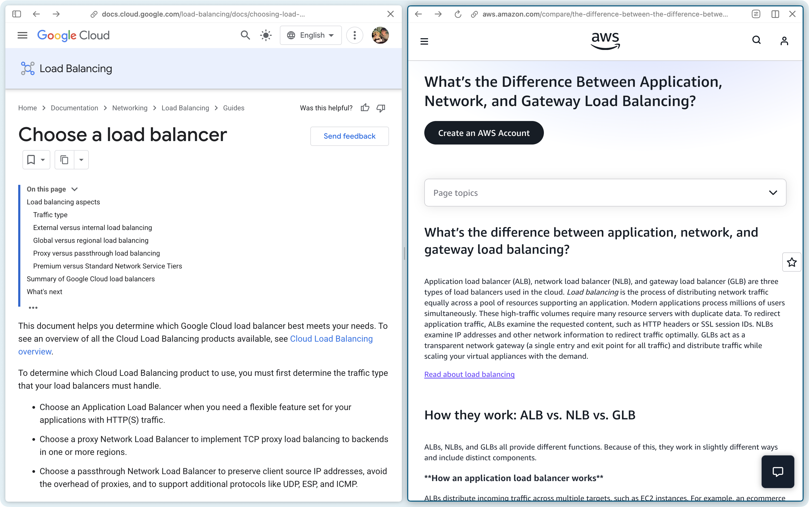
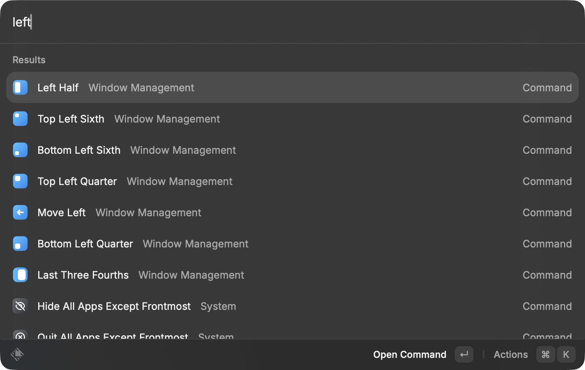
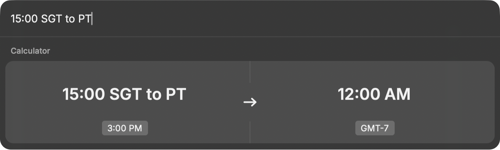

import Callout from '@/components/callout.astro'

## Overview

This is my current macOS setup, documented mostly for future me whenever I get a new machine, and partly so that I have something to point friends to when they ask. It's opinionated and personal, skews toward what I actually use daily, and skips anything I found myself not reaching for.

---

## Package Managers & Languages

- [ ] [Homebrew](https://brew.sh/), the unofficial package manager for macOS
    - With it, we can install:
	    - CLI tools (`git`, `nvm`, `wget`) with `brew install`, 
	    - and GUI apps (Docker, VSCode) with `brew install --cask`,
	- and keep everything up-to-date with a single command: `brew upgrade`.
	- The Homebrew installer will also prompt you to install **Xcode Command Line Tools**, providing many essential utilities for software development on macOS that does not come pre-installed.
	
	<Callout title="Installation steps" defaultOpen={false}>
	Install by copying and pasting the following command in your terminal:
	
	```bash
	/bin/bash -c "$(curl -fsSL https://raw.githubusercontent.com/Homebrew/install/HEAD/install.sh)"
	```
	
	Then, run the following to ensure you have the latest version and packages:
	
	```bash
	brew update
	brew upgrade
	```
	</Callout>
- [ ] [Node.js & NPM](https://nodejs.org/en/download)
	<Callout title="Installation steps" defaultOpen={false}>
    Seems better to skip the direct installer to instead use `nvm` (Node Version Manager) so you can switch Node versions per project:
    
    ```bash
    brew install nvm
    ```
    
    Then, create the directory for `nvm`:
    
    ```bash
    mkdir ~/.nvm
    ```
    
    Edit your `~/.zshrc` file with:
    
	```bash
	nano ~/.zshrc
	```
	
	And add the following lines to the end of the file:
	
	```bash
	# For NVM
	export NVM_DIR=/opt/homebrew/opt/nvm
	[ -s "$NVM_DIR/nvm.sh" ] && source "$NVM_DIR/nvm.sh"  # This loads nvm
	[ -s "$NVM_DIR/bash_completion" ] && source "$NVM_DIR/bash_completion"  # This loads nvm bash_completion
	```
	
	Finally, restart your terminal or run:
	
	```bash
	source ~/.zshrc
	```
	
	And verify your installation with:
	
	```bash
	nvm --version
	```
	
	Install specific versions with:
	
	```bash
	nvm install 24
	nvm use 24
	```
	</Callout>
- [ ] [Python](https://www.python.org/)
    
	<Callout title="Installation steps" defaultOpen={false}>
	Install via Homebrew:
	
	```bash
	brew install python
	```
	
	Verify the installation with:
	
	```bash
	python3 --version
	pip3 --version
	```
	
	Then, for any new Python project, create and activate a virtual environment so dependencies stay isolated per project:
	
	```bash
	python3 -m venv .venv
	source .venv/bin/activate
	```
	
	Once activated, `python` and `pip` (without the `3` suffix) will point to the virtual environment's versions. Install packages as usual:
	
	```bash
	pip install fastapi uvicorn
	```
	
	And when you're done, deactivate with:
	
	```bash
	deactivate
	```
	</Callout>

---

## Software Development Tools

- [ ] [Git CLI](https://git-scm.com/install/mac) for version control
    <Callout title="Installation steps" defaultOpen={false}>
    Install via Homebrew:
    
    ```bash
    brew install git
    ```
    
    Then, run the basic setup with:
    
    ```bash
    git config --global user.name "Your Name"  
	git config --global user.email "your@email.com"  
	git config --global init.defaultBranch main
    ```
	</Callout>
	
	<Callout title="Set up SSH for GitHub" variant="tip" defaultOpen={false}>
	Authenticating with GitHub over HTTPS means rotating a Personal Access Token every time it expires, even with credential caching enabled. On the other hand, SSH is set-once-and-forget. We only need to generate a key, add it to GitHub, and we're done.
	
	Generate a new SSH key:
	
	```bash
	ssh-keygen -t ed25519 -C "your@email.com"
	```
	
	Accept the default file location and set a passphrase if you'd like. Then, copy your public key to the clipboard:
	
	```bash
	pbcopy < ~/.ssh/id_ed25519.pub
	```
	
	Finally, add the key to your GitHub account at [github.com/settings/ssh/new](https://github.com/settings/ssh/new), then test the connection:
	
	```bash
	ssh -T git@github.com
	```
	
	You should see a message like `Hi <username>! You've successfully authenticated...`.
	</Callout>
- [ ] [Docker](https://www.docker.com/get-started/) for containerised development
	<Callout title="Installation steps" defaultOpen={false}>
    Download Docker Desktop from the [site](https://www.docker.com/get-started/), or via Homebrew:
    
    ```bash
    brew install --cask docker
    ```
	</Callout>
- [ ] [Visual Studio Code](https://code.visualstudio.com/) is still my go-to code editor
	<Callout title="Installation steps" defaultOpen={false}>
    Download VSCode from the [site](https://code.visualstudio.com/), or via Homebrew:
    
    ```bash
    brew install --cask visual-studio-code
    ```
	</Callout>
	
	<Callout title="Recommended configurations" variant="tip" defaultOpen={false}>
	Open the command palette (`Cmd + Shift + P`), run `Shell Command: Install 'code' command in PATH`, and you'll be able to open folders from the terminal with:
	
	```bash
	code .
	```
	</Callout>
	
	<Callout title="Recommended extensions" variant="tip" defaultOpen={false}>
	- [ ] [Material Icon Theme](https://marketplace.visualstudio.com/items?itemName=PKief.material-icon-theme) – nicer file/folder icons in the explorer
	- [ ] [Prettier – Code Formatter](https://marketplace.visualstudio.com/items?itemName=esbenp.prettier-vscode) – opinionated formatter for most web languages, with format-on-save support
	- [ ] [TODO Highlight](https://marketplace.visualstudio.com/items?itemName=wayou.vscode-todo-highlight) – highlights `TODO` and `FIXME` comments so they don't get lost
	</Callout>

- [ ] [pgAdmin4](https://www.pgadmin.org/) as a GUI for PostgreSQL databases
    - Great for quickly inspecting tables, running ad-hoc queries, and managing database users without having to drop into `psql` every time.
    
	<Callout title="Installation steps" defaultOpen={false}>
	Download pgAdmin4 from the [site](https://www.pgadmin.org/download/pgadmin-4-macos/), or via Homebrew:
	
	```bash
	brew install --cask pgadmin4
	```
	</Callout>

- [ ] [Postman](https://www.postman.com/) for building, testing, and documenting APIs
    - Great for whenever I'm developing on backends. 
    - Allows me to organise endpoints into collections, save example requests, and test auth flows.
    
	<Callout title="Installation steps" defaultOpen={false}>
    Download Postman from the [site](https://www.postman.com/downloads/), or via Homebrew:
    
    ```bash
    brew install --cask postman
    ```
    </Callout>


---

## Terminal

- [ ] [iTerm2](https://iterm2.com/), a powerful alternative to Terminal for macOS
    - Colours, readability, autocompletion and split terminal displays, iTerm2 brings many great modern quality-of-life tweaks to the terminal on MacOS.
    
    
    
    <Callout title="Recommended configurations" variant="tip" defaultOpen={false}>
	- [ ] **Set as default terminal**
	      
	      
	      
	    - In the top menu bar, click on `iTerm2` > `Make iTerm2 Default Term`.
	
	- [ ] **Disable inactive split pane dimming**
	      
	      - The default dims whichever pane isn’t focused, which gets quite distracting.
	      
	      - In the top menu bar, click on `iTerm2` > `Settings` > `Appearance` > `Dimming`, and untick the `Dim inactive split panes` checkbox.
	</Callout>

---

## Shell

- [ ] [Oh My Zsh](https://github.com/ohmyzsh/ohmyzsh)
    
	- Zsh is already the default shell on macOS, but Oh My Zsh enhances it through plugins and themes.
	- My theme of choice is [Powerlevel10k](https://github.com/romkatv/powerlevel10k).
	
	
	
	<Callout title="Installation steps" defaultOpen={false}>
	Install Oh My Zsh with the following command:
	
	```bash
	sh -c "$(curl -fsSL https://raw.githubusercontent.com/ohmyzsh/ohmyzsh/master/tools/install.sh)"
	```
	
	And for the theme, Powerlevel10k:
	
	```bash
	git clone --depth=1 https://github.com/romkatv/powerlevel10k.git "${ZSH_CUSTOM:-$HOME/.oh-my-zsh/custom}/themes/powerlevel10k"
	```
	
	Edit your shell config with:
	
	```bash
	nano ~/.zshrc
	```
	
	Update the `ZSH_THEME` section to look like this:
	
	```bash
	ZSH_THEME="powerlevel10k/powerlevel10k"
	```
	</Callout>
	
	<Callout title="Recommended plugins" variant="tip" defaultOpen={false}>
	Here are some of the plugins that I recommend starting with:
	- [ ] git – adds useful command aliases
	- [ ] [zsh-autosuggestions](https://github.com/zsh-users/zsh-autosuggestions) – suggests commands based on history
	- [ ] [zsh-syntax-highlighting](https://github.com/zsh-users/zsh-syntax-highlighting) – highlights valid/invalid commands in real-time with colours!
	
	The `git` plugin ships with Oh My Zsh, but `zsh-autosuggestions` and `zsh-syntax-highlighting` need to be cloned in manually first:
	
	```bash
	git clone https://github.com/zsh-users/zsh-autosuggestions \
	  ${ZSH_CUSTOM:-~/.oh-my-zsh/custom}/plugins/zsh-autosuggestions
 
	git clone https://github.com/zsh-users/zsh-syntax-highlighting \
	  ${ZSH_CUSTOM:-~/.oh-my-zsh/custom}/plugins/zsh-syntax-highlighting
	```
	
	Then edit your shell config with:
	
	```bash
	nano ~/.zshrc
	```
	
	And update the `plugins=()` section to look like this:
	
	```bash
	plugins=(git zsh-autosuggestions zsh-syntax-highlighting)
	```
	</Callout>

---

## Web Browser

- [ ] [Arc Browser](https://arc.net/)
	- I’ve been using Arc for how content-focused and clean its UI is, but its team has basically halted development of new features, and at this point, I do believe it’s worth exploring alternatives.
	
	
	
	- Still, it has some great features worth sticking around for, and those include:
	
		- **Spaces**: basically profiles or workspaces each with their own tabs, pinned tabs (basically bookmarks), cookies, history and extensions. Quick switch using `Ctrl + [number]`.
		- **Vertical Sidebar**: controversial and opinionated, but I find this feature really great for tab management and when toggled to be hidden, tabs stay out of the way when browsing content.
		- **Split View**: side-by-side tabs in one window. Useful for quick comparisons!
	
	
	
	<Callout variant="important">
	Arc auto-archives (deletes) inactive tabs after a set time, up to 30 days, and there's no setting to disable this. Definitely a bold choice, and one that will need some getting used to. 
	
	**The workaround**: pin any tabs you actually want to keep around.
	</Callout>

---

## Productivity & Lifestyle


- [ ] [Notion](https://www.notion.com/desktop) / [Obsidian](https://obsidian.md/) for note taking, based largely on preference

- [ ] [Anki](https://apps.ankiweb.net/) for spaced-repetition flashcards
    - I use this for retaining technical concepts and anything that I want to remember long-term. The mobile app syncs with the desktop version through [AnkiWeb](https://ankiweb.net/), so I can do quick reviews during my daily commutes.

- [ ] Apple **Mail**, **Reminders**, and **Calendar** (already comes pre-installed on macOS)
    - Nothing fancy here, just the default Apple apps. 
    - I stick with them because of how seamlessly and simple they are.

- [ ] [Spotify](https://www.spotify.com/)

---

## Additional Tools Utilities

- [ ] [Raycast](https://www.raycast.com/), a replacement to the built-in Spotlight feature
    
    - Boosts productivity and absolutely brilliant for some of my daily use cases like:
	    - launching applications,
	    - searching and managing files,
		- accessing clipboard history,
		- managing windows intuitively,
		  
		- and quick conversions!
		  
	
	- It even has a [store for community-built extensions](https://www.raycast.com/store). Honestly, this is one of those tools I can't imagine switching back from.
	- No, seriously, try it out! :))
	
	<Callout title="Installation steps" defaultOpen={false}>
    Download Raycast from the [site](https://www.raycast.com/), or via Homebrew:
    
    ```bash
    brew install --cask raycast
    ```
    </Callout>

- [ ] [Blip](https://blip.net/) for quick, convenient, cross-platform file sharing
    - AirDrop is locked to the Apple ecosystem and to close-proximity sharing, so I use Blip to send large files across my various devices, including Android and Windows.

## macOS Settings

### Finder

- [ ] **Enabling file name extensions**
    - On the top menu bar, click `Finder` > `Settings` > `Advanced` > Check `Show all filename extensions`.

### Dock

- [ ] **Automatically hide**
    - In `System Settings` > `Desktop & Dock` > Enable `Automatically hide and show the Dock`.
