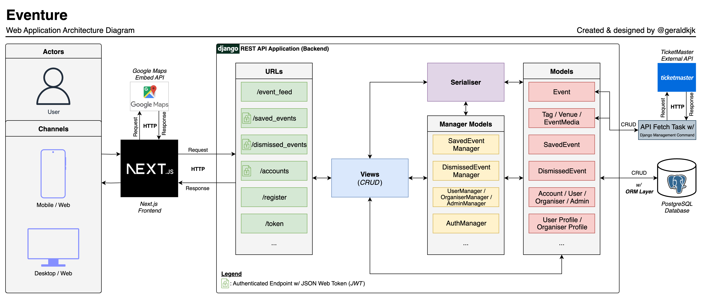
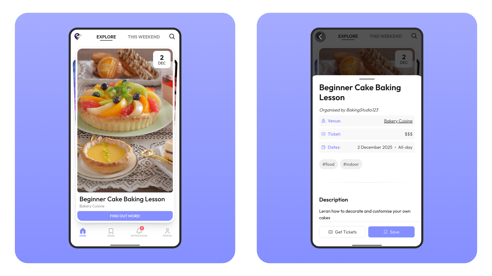
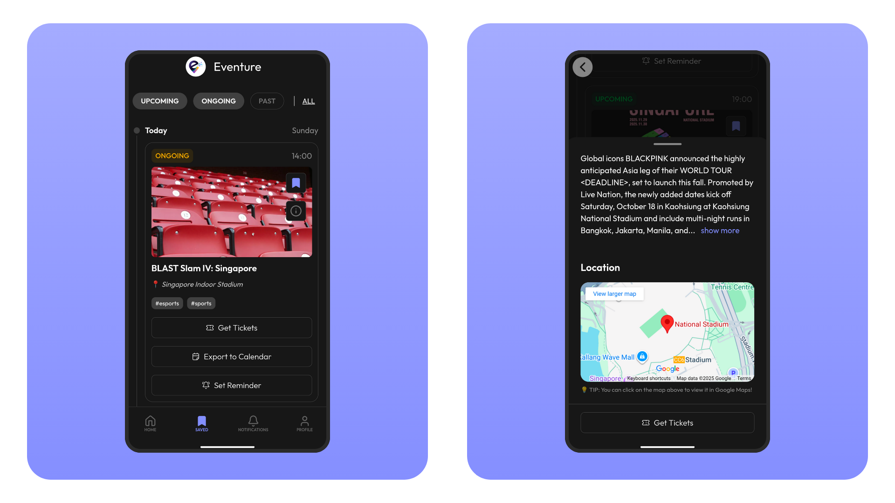

## Introduction
For my software engineering module assignment, my team built **Eventure**, a mobile-first web platform for event discovery. The project was part of a Smart Nation-themed assignment, where teams were challenged to build an application utilising APIs that pulled real-world data and was able to demonstrate that it delivered clear value to intended users, rather than simply displaying that information on a flat screen. The project ran over the course of the semester and was assessed not only on the final prototype, but also on the quality of the team’s process and deliverables throughout the semester.

What stood out to me about this module was that it kind of pushed us straight into the deep end. We were expected to figure out how to design and build a full-stack application while simultaneously learning how to work through the full software development lifecycle (SDLC). That meant moving from requirements elicitation and analysis into design, implementation, testing, documentation, and finally a live demo. Fortunately, I came into the project with some prior experience from polytechnic, so I was able to approach that learning curve with a bit more confidence, and help guide and lead development within the team.

In this post, I just want to share what my team and I had worked on and more importantly, detail what I had learnt in the process.
## What is Eventure?
We eventually landed on the idea of an event discovery platform.

What made this idea caught on for us was that event discovery already exists, but often in a form that feels static, cluttered or overly text-heavy. Users can find events through services like Google Search and ticketing platforms, but the experience can feel overwhelming and not exactly engaging. **Eventure** was our attempt to reimagine that experience and make discovering events feel more intuitive, interactive, approachable and most importantly, fun.

That was where the swipe-based idea came in. Instead of asking users to scroll through boring text-heavy event listings, we wanted them to move through events quickly, react to them naturally, and only spend more time on those that actually interested them. It gave the project a clearer product identity and helped us move beyond the ideation phase.

At the same time, we also wanted the platform to be useful not just for attendees, but for smaller organisers as well, as part of the smart nation initiative. So that **Eventure** would be multi-layered and more than just an discovery feed. We also included an organiser side where event organisers could submit and manage events, and an admin side where those submissions could be reviewed and moderated before being published to users.
## Tech stack and system design

**Eventure** was designed as a decoupled client-server application. The frontend was built with **Next.js**, **TypeScript**, and **Tailwind CSS**, while the backend was built using **Django REST Framework** and **PostgreSQL**. We also integrated external services such as the **Ticketmaster Discovery API** for real-world event data, **Google Maps** for venue-related navigation, and **Gmail SMTP** for email verification and password reset user flows.

The reason we went with this structure was fairly straightforward, we wanted clear separation between presentation and business logic. The frontend could focus on user interaction and rendering the interface, while the backend handled the JWT authentication, event management, data persistence, and external API integration. That separation made the system easier to reason about, easier to divide across team members, and easier to maintain as the scope grew later in the project. It also made the architecture feel closer to how production web applications are typically structured, rather than everything being tightly coupled in one place. 

On the backend side, we also exposed interactive API documentation through Swagger/OpenAPI, which made it much easier to test endpoints and understand how the system was evolving during development. Another practical advantage of using Django was the built-in admin panel, which gave the team a much more convenient way to inspect and manage data without needing to work directly through the CLI or pgAdmin every time.

I also took this project as an opportunity to utilise **Docker**. Having a containerised setup helped reduce environment-related friction across the team and made it easier for everyone to run the project consistently. It also reinforced something I had already started appreciating from past experience during polytechnic: even in school projects, **a smoother development environment can make a very real difference to team productivity**.

Looking back, I think this part of the project was one of the most meaningful and fun for me. It was one thing to build features, but another to think clearly about why the system should be structured a certain way. Even for a school project, being forced to justify architecture decisions helped me appreciate that good software design is not just about getting things to work, but about making the system understandable, maintainable, and easier for a team to build on.
## What I was responsible for
My own contributions were largely on **technical direction, system design, and development structure**.

Because I came in with more prior experience, I ended up taking on a more active role in guiding how the application was structured and how development would move forward. A big part of my involvement was helping shape the technical foundation of the project, especially around how the frontend and backend should interact, how responsibilities should be separated, and how we could build in a way that remained manageable for the team.

I was also heavily involved in documenting and communicating that structure. That included contributing to the project’s technical writeups, thinking through the overall application skeleton, and helping ensure that what we were building was not just functional, but also coherent from a software engineering perspective. I found that work especially valuable because it forced me to articulate decisions clearly, rather than just making them intuitively.

More broadly, I also found myself helping to guide development discussions and acting as a bridge between the product idea and the actual technical implementation. In many team projects, it is easy for people to focus only on the piece immediately in front of them. What I learnt here was that someone often needs to keep sight of the bigger picture: how the pieces connect and whether the system still makes sense as a whole after working on individual features for a period of time.
## Challenges we faced

One of the biggest challenges was not building the application, but coming up with the formal software engineering documents itself.

This module was not only asking us to build a working application, but also to produce a long chain of deliverables across the SDLC: requirements, use case models, class diagrams, sequence diagrams, dialog maps, system architecture, application skeleton, testing artefacts, demo preparation, and final documentation. That meant the project was never just “build the app”. It was also about continuously translating what we were building into formal software engineering artefacts at each stage.

Another challenge was **keeping the project manage-able** in scope. **Eventure** had not just one user flow. It involved regular users, organisers, and admins, each with their own feature sets. On the user side alone, there was registration, login, profile management, event browsing, saved events, notifications, search, and calendar export. On top of that, we also had organiser event creation and updating, as well as admin approval flows. Once you put all of that together, the project becomes quite a bit larger than it first sounds.

On the team side, I also found task delegation harder than I initially expected. It was not just about assigning work evenly, but about balancing different things at once:
- what each person was comfortable with, 
- what they wanted to learn, 
- what the project urgently needed, 
- and how interdependent certain tasks were (*and whether it would overlap another's work*). 

In practice, this took a lot more coordination and communication, especially when the project is moving quickly due to the tight timeline and we were learning as we go.

I think that was one of the more underrated parts of the project for me. Technical decisions were important, but so was making sure the team could actually execute on them smoothly. A project can have a decent idea and a workable architecture, but if responsibilities are unclear or the handoffs between people are weak, progress starts slowing down very quickly.
## What I learnt from the project

Looking back, one of the biggest things this project taught me was that software engineering is rarely just about writing code. A lot of the real work happens before and around implementation.

One lesson that stood out to me was how quickly even a relatively small product can become complex. On paper, **Eventure** sounded fairly straightforward, an event discovery platform. But once multiple user groups, external API integrations, documentation requirements, and team coordination entered the picture, the project became far more layered and complex than it first appeared. What made the difference was not just whether we could implement features, but whether we could organise the system clearly, separate responsibilities properly, and make decisions that kept development sustainable over time.

That changed how I think about engineering work. A good system is not just one that works, but one that remains understandable to the people building and maintaining it. In that sense, software engineering is often about reducing complexity just as much as it is about delivering functionality.

On a more personal level, this project also helped confirm the kind of work I find most engaging.

I enjoyed building features, but what I found especially meaningful was thinking about how the system should come together as a whole. I liked considering how different components should interact, how responsibilities should be divided, how the design should support future growth, and how those decisions could be communicated clearly to others. That broader system-level view was something I found myself naturally drawn to throughout the project.

I think that is what made **Eventure** stand out to me. It did not just strengthen my technical skills, it also gave me a clearer sense of the kind of engineering problems I enjoy solving.
## What I would improve if I continued it
If I were to continue working on **Eventure**, here is a quick list of features I would add/improve:

- **Event recommendation.** One of the first things would be the discovery experience itself. The swipe-based idea gave the platform a strong identity, but I think there is still a lot of room to make the browsing experience more personalised and intelligent. For example, I would want to explore better filtering, user preference modelling, and tailored event suggestions over time using recommendation systems.
- **Organiser analytics.** I would also want to improve the organiser side of the platform. While the core functionality was there, I think that part of the system could be made much more polished and practical. Features like better event analytics, more intuitive event management flows, and clearer moderation feedback would make the platform more useful for organisers rather than treating them as a secondary user group.
## Conclusion
Looking back, **Eventure** was meaningful to me not only because of what my team built, but because of what the project revealed about the kind of engineer I want to become.

More than giving me another project to talk about, **Eventure** gave me a stronger appreciation for system design, technical direction, and the importance of thinking beyond the feature in front of me. It made me more certain that the kind of work I enjoy sits at the intersection of implementation, architecture, and clarity.